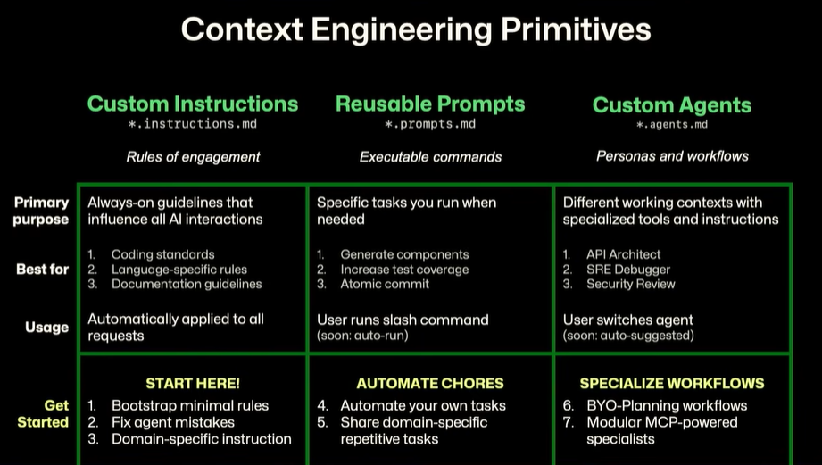

# GitHub Copilot Demo

- Dette er virkelig bra fordi det lar deg legge til helpers i VS Code og slutte å kopiere og lime inn de lagrede prompts dine i GitHub Chat Window.

## Lagrede prompts for gjenbrukshjelpere på tvers av team

| | Custom Instructions | Reusable Prompts | Custom Agents |
| :--- | :--- | :--- | :--- |
| **Fil mønster** | `*.instructions.md` | `*.prompts.md` | `*.agents.md` |
| **Kjernekonsept** | Regler for engasjement | Kjørbare kommandoer | Personaer og arbeidsflyter |
| **Hovedformål** | Alltid-på retningslinjer som påvirker alle AI-interaksjoner | Spesifikke oppgaver du kjører ved behov | Ulike arbeidskontekster med spesialiserte verktøy og instruksjoner |
| **Best for** | 1. Kodestandarder 2. Språkspesifikke regler 3. Dokumentasjonsretningslinjer | 1. Generere komponenter 2. Øke testdekning 3. Atomiske commits | 1. API Arkitekt 2. SRE Feilsøking 3. Sikkerhetsgjennomgang |
| **Bruk** | Brukes automatisk på alle forespørsler | Bruker kjører skråstrek-kommando | Bruker bytter agent |

## Saved prompts for reuse helpers across teams

| | Custom Instructions | Reusable Prompts | Custom Agents |
| :--- | :--- | :--- | :--- |
| **File Pattern** | `*.instructions.md` | `*.prompts.md` | `*.agents.md` |
| **Core Concept** | Rules of engagement | Executable commands | Personas and workflows |
| **Primary Purpose** | Always-on guidelines that influence all AI interactions | Specific tasks you run when needed | Different working contexts with specialized tools and instructions |
| **Best For** | 1. Coding standards 2. Language-specific rules 3. Documentation guidelines | 1. Generate components 2. Increase test coverage 3. Atomic commit | 1. API Architect 2. SRE Debugger 3. Security Review |
| **Usage** | Automatically applied to all requests | User runs slash command | User switches agent |

